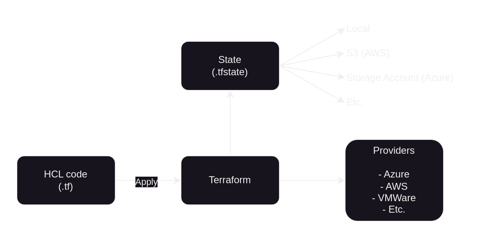
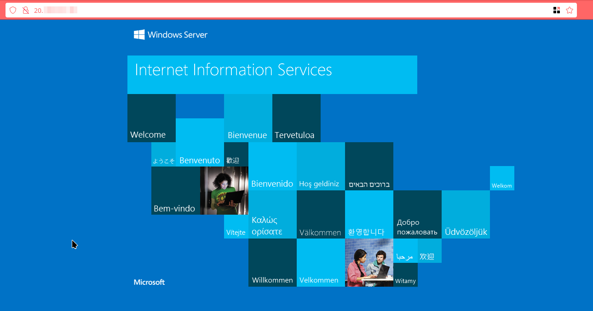

# Terraform 101

This project is aimed at system administrators and developers interested in adopting DevOps methodologies in their projects. Specifically, it focuses on using Terraform for infrastructure creation and management. As a practical example, a demonstration is included to create a virtual machine in Azure with IIS installed.

## Introduction

[Terraform](https://www.terraform.io/) is an Infrastructure-as-Code (IaC) tool created and maintained by [HashiCorp](https://www.hashicorp.com/) that allows you to create cloud or on-premise resources with code, such as servers, databases, storage, and networks. This tool is declarative, so when the tool runs, what is written as code will be the final state of the resources, regardless of any manual changes made before via the portal or CLI.

### Advantages of Using Terraform

- Multi-Cloud: Supports various cloud providers such as AWS, Azure, and GCP.
- Declarative: Define the desired infrastructure state using code.
- Modularity: Create reusable modules for different projects.
- Community: Widely used DevOps tool with a large, helpful community.
- Reproducibility: Use the same code to create different environments simultaneously.

## HashiCorp Configuration Language (HCL)

Terraform uses its own language called [HCL](https://developer.hashicorp.com/terraform/language/syntax/configuration) which uses blocks for creating configurations and resources.

This code must be saved as `.tf` files. It is important to know that it is not necessary for the code to be written in the same file. It is possible to separate it into different files with any name, allowing you to group common resources in those files.

The two main blocks needed for using Terraform are:

- [terraform](https://developer.hashicorp.com/terraform/language/terraform): For configuring Terraform and declaring providers to use.
- [provider](https://developer.hashicorp.com/terraform/language/providers): For configuring the provider declared before.

```hcl
# Declare AWS Provider and version
terraform {
    required_providers {
        aws = {
            source  = "hashicorp/aws"
            version = "~> 5.0"
        }
    }
}

# Configure the AWS Provider
provider "aws" {
    region = "us-east-1"
}
```

### Resource Block

This is probably the most important [block](https://developer.hashicorp.com/terraform/language/resources) used in Terraform. This element creates a new resource and tracks it on the provider, such as virtual machines, networks, storage, etc.

```hcl
#  element   its type    its name
#    |          |           |
#    |          |           |
#    v          v           v
  resource "aws_instance" "web" {
    ami           = data.aws_ami.ubuntu.id      # Arguments
    instance_type = "t3.micro"                  #     |
                                                #     |
    tags = {                                    #     |
        Name = "HelloWorld"                     #     |
    }                                           #     v
  }
```

This block creates a virtual machine (EC2 instance) on AWS called `HelloWorld` with a `t3.micro` type using `Ubuntu`.

### Data Block

This is another important [element](https://developer.hashicorp.com/terraform/language/data-sources), used to get information about resources already created outside of Terraform.

```hcl
# element  its type  its name
#   |         |         |
#   |         |         |
#   v         v         v
  data "aws_instance" "foo" {
    instance_id = "i-instanceid"        # Arguments
                                        #     |
    filter {                            #     |
      name   = "image-id"               #     |
      values = ["ami-xxxxxxxx"]         #     |
    }                                   #     |
                                        #     |
    filter {                            #     |
      name   = "tag:Name"               #     |
      values = ["instance-name-tag"]    #     |
    }                                   #     v
  }
```

This block finds an EC2 instance with the ID `i-instanceid`. Then, it is possible to use its information as variables in the Terraform code.

## Registry

HashiCorp has a [place](https://registry.terraform.io/) for saving any kind of resources as modules, providers, libraries and documentation.

It is recommended to read the provider documentation and follow recommendations for creating resources before starting a project.

## Providers

[Providers](https://registry.terraform.io/browse/providers) are Terraform components for communicating with APIs to create resources, whether cloud or on-premise. There are three types:

- Official: Providers maintained by HashiCorp.
- Partner: Maintained by important companies.
- Community: Maintained by the community. Sometimes these can be unstable or insecure to use.

## Modules

[Modules](https://registry.terraform.io/browse/modules) are like "packages" of Terraform code that allow you to reuse configurations for other projects.

For example, if there is often a need to create a basic group of resources on the cloud such as a VM connected to the internet, a security group, a load balancer, etc., it may be better to create a module and reuse it every time.

So, instead of creating every resource individually, you can call the module, and this package will create everything necessary to make it work correctly.

## State File

The [state](https://developer.hashicorp.com/terraform/language/state) is a text file for tracking all the resources created by the Terraform project. By default, this file is saved on the local machine, but it is possible to store it in the cloud and share resources, such as a Storage Account or S3. This way, a team can collaborate on the same project using the same state. Another important aspect of this method is the ability to keep backups of the file.

This place for saving the state on an external source is called a "backend". To configure it, you need to set it up in the `terraform` block as shown below:

```hcl
# Configure an AWS S3 bucket as backend
terraform {
    backend "s3" {
        bucket = "mybucket"
        key    = "path/to/my/key"
        region = "us-east-1"
    }
}
```

## Architecture

The way Terraform works is:

- Write the code for connecting to a provider and create resources on a `.tf` text file.
- **(optional)** Select on the code or the `apply` command where to save the state. By default, it will be saved in the local folder.
- Run Terraform commands to apply changes.
- Terraform will compare the code with the current state of the resources and will apply changes to make the resources exactly as the code specifies.
- Modified code and run Terraform again to apply changes.



## Installation

Depending on the OS used, there are [different ways](https://developer.hashicorp.com/terraform/tutorials/aws-get-started/install-cli) to install Terraform.

## Main Commands

- `terraform init`: Set up the backend and download necessary packages.
- `terraform validate`: Validate Terraform syntax.
- `terraform plan`: Preview the changes Terraform will make.
- `terraform apply`: Apply the planned changes.
- `terraform destroy`: Destroy all resources created by Terraform.

## Demonstration

This laboratory aims to create a Windows server with IIS installed using Terraform.

There are four important files:

- `provider.tf`: Configuration for connecting to Azure.
- `iis.tf`: Resources for creating the VM and necessary components.
- `variables.tf`: Variables used by Terraform (only for subscription ID).
- `outputs.tf`: Display the outputs (only server public IP).

### Prerequisites

- Azure account and subscription.
- Tenant and subscription IDs.
- Azure CLI installed.
- Terraform installed.

### Steps

#### Azure CLI

First, configure the Azure CLI.

```bash
az login
# If you have more than one tenant, use: az login --tenant "XXXXXXXX-XXXX-XXXX-XXXX-XXXXXXXXXXXX"
az account set --subscription="XXXXXXXX-XXXX-XXXX-XXXX-XXXXXXXXXXXX"
```

#### Terraform Project

Now, run the Terraform commands.

```bash
export TF_VAR_AZURE_SUBSCRIPTION_ID="XXXXXXXX-XXXX-XXXX-XXXX-XXXXXXXXXXXX"
terraform init
```

Expected result: `Terraform has been successfully initialized!`

```bash
terraform validate
```

Expected result: `Success! The configuration is valid.`

```bash
terraform plan
```

Expected result: `Plan: 9 to add, 0 to change, 0 to destroy.`

```bash
terraform apply
```

Expected result: `Enter a value:`. Type `yes` and press `enter`.

Wait for the process to complete. Once finished, you should see:

```
Apply complete! Resources: 9 added, 0 changed, 0 destroyed.

Outputs:
public_ip_address = "20.XXX.XXX.XXX"
```

Now, you have the public IP and can access the web server:


Once the lab is finished, you can easily clear the resources to avoid consuming credit with the following command:

```bash
terraform destroy
```

Expected result: `Destroy complete! Resources: 9 destroyed.`

Now you are back to the point where the resources created by Terraform didn't exist.

## Future

Although most cloud providers typically offer their own IaC tools for use on their platforms, Terraform is currently the most widely used due to its multi-cloud nature. This means that if a provider change is desired, there is no need to learn a new tool to make the transition.

Additionally, thanks to its open-source nature and the extensive community that supports it, Terraform is one of the favorite tools among DevOps professionals.

However, since 2024, HashiCorp changed Terraform's license to BUSL. In response, the community created a fork called [OpenTofu](https://opentofu.org/), which is now being managed by the Linux Foundation.
